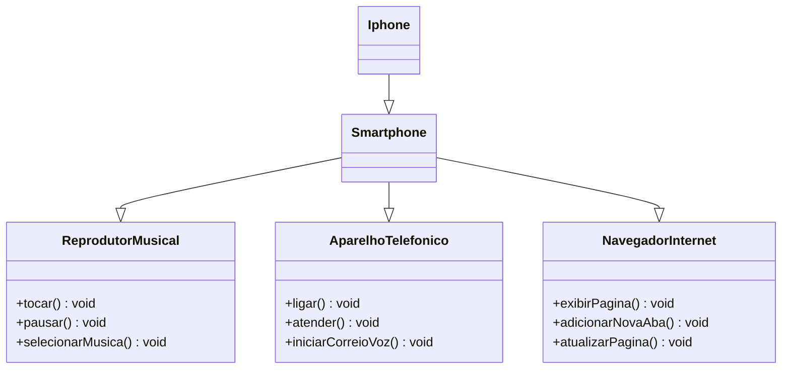

### Diagrama UML do Iphone (Mermaid)

```mermaid
classDiagram
    Smartphone --|> ReprodutorMusical
    Smartphone --|> AparelhoTelefonico
    Smartphone --|> NavegadorInternet
    Iphone --|> Smartphone
    class ReprodutorMusical{
      +tocar() void
      +pausar() void
      +selecionarMusica() void
    }
    class AparelhoTelefonico{
      +ligar() void
      +atender() void
      +iniciarCorreioVoz() void
    }
    class NavegadorInternet{
      +exibirPagina() void
      +adicionarNovaAba() void
      +atualizarPagina() void
    }
```
